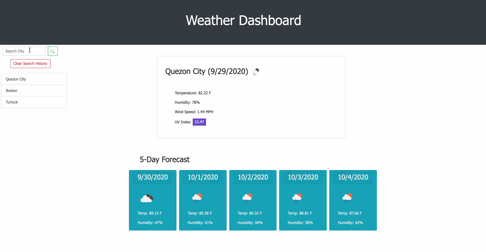
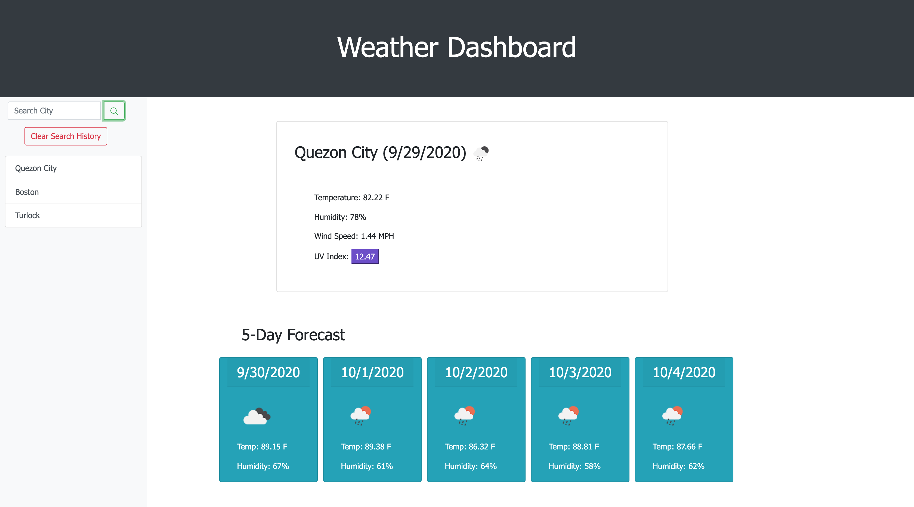

# Cloudy With A Chance of JavaScript (Weather Dashboard)

In this project, I’ve created an application that displays the current weather and a five-day forecast. When you open the link, I've designed this weather dashboard in a way which it will only display the current weather of San Francisco as a default display for a clean minimalistic look until the user decides to add value into the input field to search for the city, then will this dashboard display a five-day forecast of the weather for the user, the current weather conditions and a search history displayed at the sidebar for the user to look over again. In this case, I have used third-party APIs to access the data of OpenWeather which allows me to create this application. The user and other travelers can use this application that allows them to check the weather in multiple so that they may plan their trips accordingly.

I did enjoy doing this project but I did face the challenge on how to catch errors when the user inputs an invalid city. I didn't have enough time to look into it and neither did I know how to access that as this wasn't initially taught on how to return any errors on the AJAX call but I would definitely add this feature once I understand it and its complexity. As a new coder, I was able to accomplish most of what the user wanted for this application.

## Table of Contents

* [Features](#features)
* [Technologies Used](#technologies-used)
* [GIF of Project](#gif-of-project)
* [Image of Project](#image-of-project)
* [Code Snippet](#code-snippet)
* [Deployed Link](#deployed-link)
* [Authors](#authors)
* [License](#license)
* [Acknowledgments](#acknowledgments)

## Features

This project includes the following features:

* Sidebar 

    Search city input field
    Stored search history using local storage

* Current Weather Main Box

    City with current date using moment.js and the weather icon
    Temperature converted to Farenheit
    Humidity
    Wind Speed
    UV Index color coded by the value

* Five Day Forecast Display
    Date 
    Weather Icon
    Temperature (farenheit)
    Humidity

## Technologies Used

* [HTML](https://developer.mozilla.org/en-US/docs/Web/HTML)
* [CSS](https://developer.mozilla.org/en-US/docs/Web/CSS)
* [Bootstrap](https://getbootstrap.com/)
* [Javascript](https://developer.mozilla.org/en-US/docs/Web/JavaScript)
* [jQuery](https://jquery.com/)
* [API-Momentjs](https://momentjs.com/)
* [API-OpenWeather](https://openweathermap.org/)

## GIF of Project

Although not seen clearly but I performed a refresh or reload of the page after typing.



## Image of Project

Attached below is a picture of the application.



## Code Snippet

In this code snippet, this is the for loop that creates the buttons on the sidebar and the second code snippet is where the clicking the search button that has an event listener to grab the input value, calls my next function and pushes the values into the empty array and setting the values into local storage which will then get the items to and then calls this renderButtons function as to keep the user's search history or if the user would like to clear the history as seen on the third code snippet, then the page will return into its default display which is the current weather of San Francisco.
```
 // function to render the buttons on sidebar
    function renderButtons() {

        // to make sure values or the buttons don't duplicate
        $("#addCityBtn").empty();

        // if user types in the same city name, it won't create a duplicate
        let uniqueSet = new Set(cityArray);
        cityArray = [...uniqueSet];

        // for loop to create new buttons for each city on sidebar
        for (let j = 0; j < cityArray.length; j++) {

            let cityBtn = $("<button>");
            cityBtn.addClass("newCityBtn");
            cityBtn.addClass("list-group-item");
            cityBtn.addClass("list-group-item-action");
            cityBtn.attr("type", "button");
            cityBtn.attr("data-name", cityArray[j]);
            cityBtn.text(cityArray[j]);
            $("#addCityBtn").prepend(cityBtn);
        };
    };
```
```
// empty array for storing city names 
    let cityArray = [];

 // grabs the items from local storage
    let saveCityNames = JSON.parse(localStorage.getItem("cityArray"));

    // if else statements on keeping search history on page or return to default display if user clears search history
    if (saveCityNames !== null) {
        cityArray = saveCityNames;
        renderButtons();
        currentWeather(cityArray[cityArray.length - 1]);
    } else if (saveCityNames == null) {
        defaultDisplay();
    };

    // search button event listener
    $("#searchBtn").on("click", function(event) {
        event.preventDefault();

        // grabs the input value from the search bar
        let searchCity = $("#searchInput").val().trim();

        //shows five day forecast when user puts value in input field
        $(".fiveDisplay").show();
        $(".forecastText").show();

        // calls current weather function
        currentWeather(searchCity);

        // pushes user's input into the empty array
        cityArray.push(searchCity);

        // sets item into local storage
        localStorage.setItem("cityArray", JSON.stringify(cityArray));

        // clears input field after clicking the search button
        $("#searchInput").val("");
    });
```
```
    // event listener for clear history button
    $(".clear").on("click", function() {
        cityArray = [];
        localStorage.clear();
        $(".newCityBtn").remove();
    });

```

## Deployed Link

* [See Live Site](https://janessaref.github.io/cloudy-with-a-chance-of-javascript/)


## Authors

* Janessa Reeanne Fong

- [Link to Github](https://github.com/janessaref)
- [Link to LinkedIn](https://www.linkedin.com/in/janessafong)

## License

This project is licensed under the MIT License 

## Acknowledgments

* I'd like to acknowledge my tutor Andrew Knapp for helping me shorten my code with the five-day forecast as well as other parts of my code and for teaching me new set which grabs unique values to minimize repitition.
* I'd like to also acknowledge my instructors and TAs, Roger Lee, Kerwin Hy and Manuel Nunes that helped me towards accomplishing this project.

